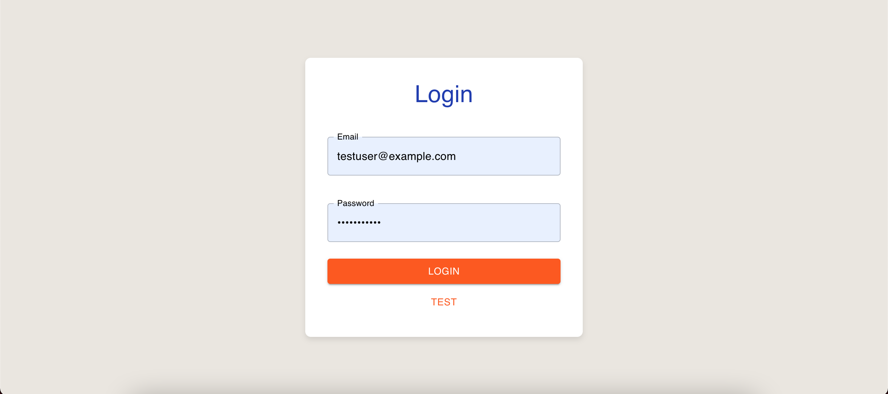
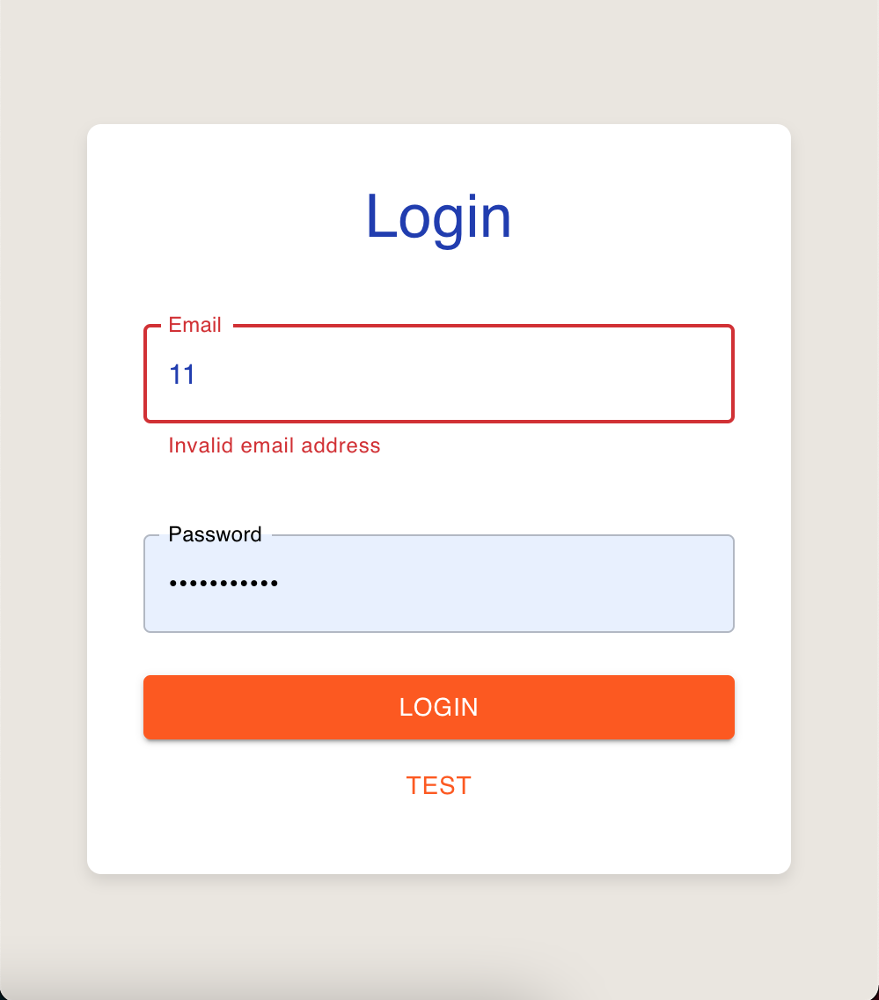
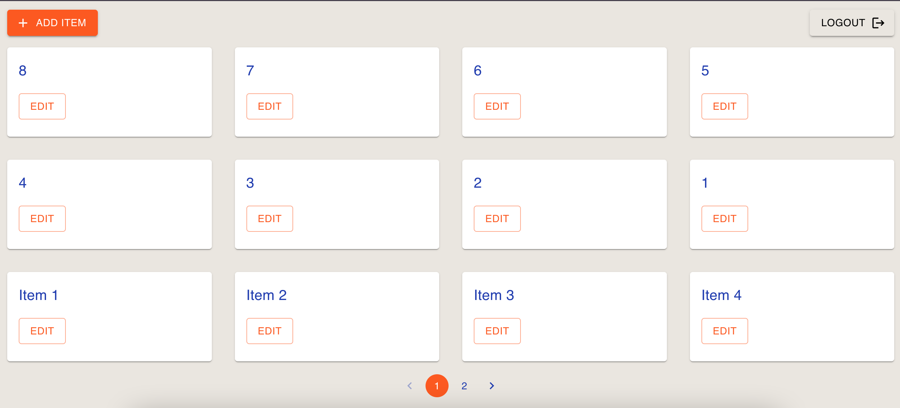
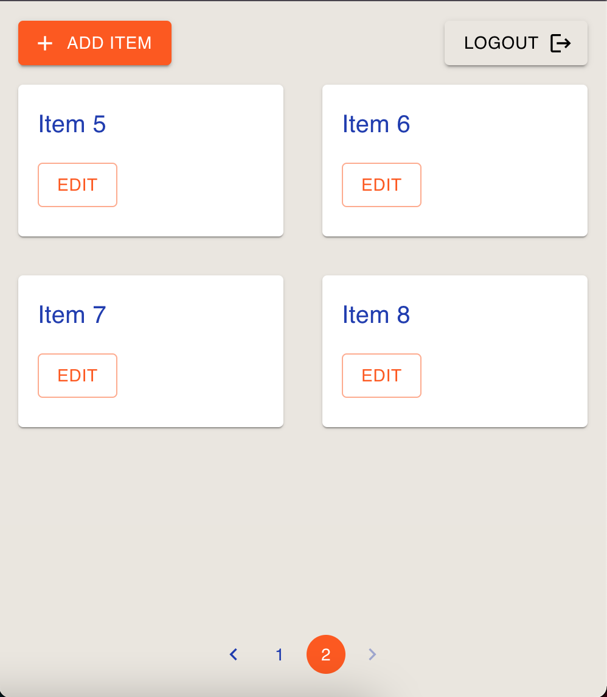

# <a href="https://react-login-items-app.vercel.app/login" target="_blank">React SPA with Login and Item Management (Dec 2024)</a>

This is a small Single Page Application (SPA) built with React, Redux Toolkit, and Material UI. The app features a user login page and an item management page where users can add and edit items.

## Screenshots
You can see the design and layout of the app with the following images:

  
  

  
  

## Features
- **Login Page**: A simple form for users to log in using email and password.
- **Items Page**: Displays a list of items with options to add and edit.
- **State Management**: Uses Redux Toolkit for managing user login state and item data.
- **Material UI**: For styling and UI components such as forms, buttons, and dialogs.
- **Formik + Yup**: For form handling and validation.
- **Routing**: React Router is used for page navigation.
- **Testing**: Basic tests with Jest and React Testing Library.

## Folder Structure

src/
├── components/ 
│ ├── ItemDialog.tsx 
│ ├── LoginForm.tsx 
│ ├── Pagination.jsx 
├── pages/ 
│ ├── LoginPage.tsx 
│ ├── ItemsPage.tsx 
├── store/ 
│ ├── store.ts 
│ ├── userSlice.ts 
│ ├── itemsSlice.ts 
├── App.tsx 
├── App.test.ts

## Components
### `ItemDialog.tsx`
A dialog box for adding and editing items. It uses **Formik** to manage form data and **Material UI** components to display the dialog and form fields. 

### `LoginForm.tsx`
A form for logging in. It uses **Formik** for form handling and **Yup** for validation to ensure the email and password are entered correctly.

### `Pagination.jsx`
A simple component to handle pagination of items on the **Items Page**. This component is basic and works as a placeholder for more advanced features.

### `LoginPage.tsx`
The page where users log in. If the user is already logged in, they are redirected to the **Items Page**.

### `ItemsPage.tsx`
The page that shows a list of items. Users can add new items or edit existing ones using a dialog form.

## Redux State Management
### `userSlice.ts`
Handles the login state, such as checking if the user is logged in (`isLoggedIn`).

### `itemsSlice.ts`
Handles the items list. It includes actions for adding and editing items in the list.

### `store.ts`
Sets up the **Redux store** and combines all slices (user and items) into one store.

## Styling
The app uses **Material UI** for consistent design. It includes components like buttons, text fields, and dialog boxes. Some styles are applied using the **sx** prop from **Material UI** components, and others are customized using the `styled` utility.

## Testing
Basic tests are included with **Jest** and **React Testing Library** to test the core functionality:

- **LoginPage.test.ts**: Tests rendering of the login form.
- **App.test.ts**: Tests rendering of the App component.

## How to Run

1. Clone this repository.
2. Navigate to the project directory.
3. Run `npm install` to install dependencies.
4. Run `npm start` to start the development server.
5. Open your browser and go to `http://localhost:3000` to view the app.

## Author
 
[Olexandra Kunytska](https://github.com/olexandracodes) - Frontend developer